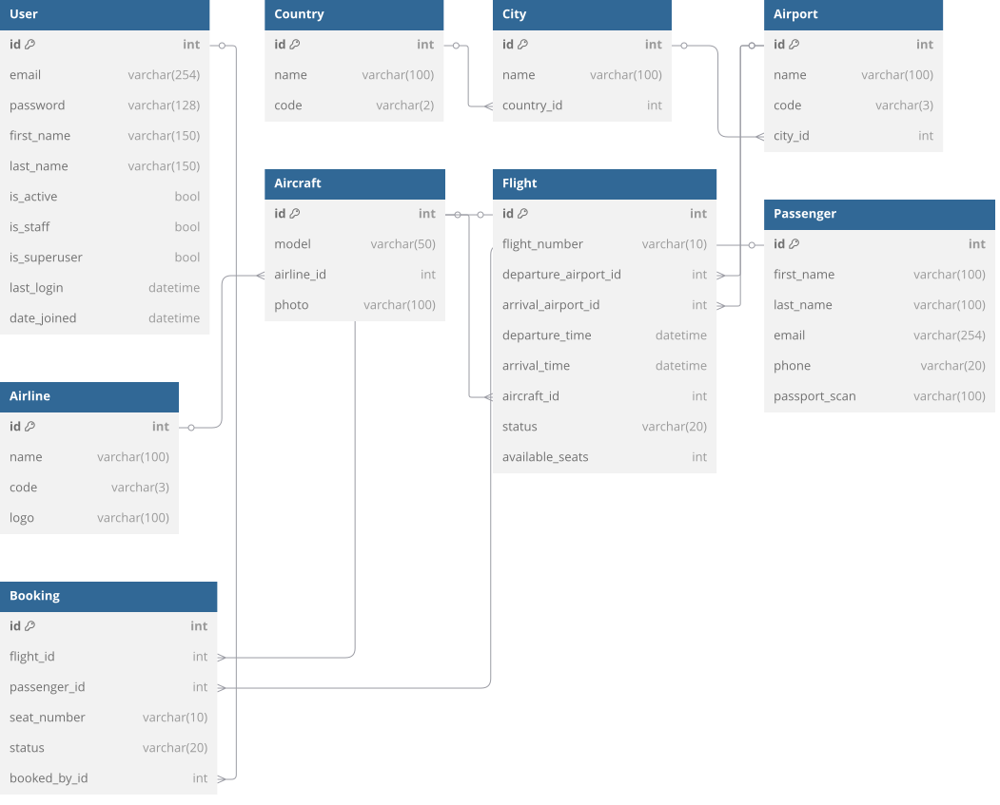

# ✈️ Airport Management API  
**REST API for flight booking system with JWT authentication & Docker deployment**  

  
  
 

  
  


## 📌 Key Features  
- **Flight & Route Management** (Countries → Cities → Airports)  
- **Airline/Aircraft CRUD** with media uploads  
- **Booking System** with seat availability checks  
- **JWT Authentication** for passengers/staff  
- **Real-time Status Updates** (Scheduled/Delayed/Canceled)  
- **Smart Filtering & Search** (flights, bookings, users)  
- **Ordering & Pagination** across list views  
- **Throttling**: rate-limited API access for anonymous users  
- **Swagger Documentation** with OpenAPI 3.0  

---

## 🛠 Tech Stack  
| Layer          | Technology                          |
|----------------|-------------------------------------|
| **Backend**    | Django 4.2 + Django REST Framework  |
| **Database**   | PostgreSQL 15 (with PostGIS-ready)  |
| **Auth**       | JWT (Access/Refresh tokens)         |
| **Deployment** | Docker + Docker Compose             |
| **Docs**       | Swagger/Redoc                       |

---

## ⚙️ Built-in API Capabilities  
| Feature       | Example Usage                                           |
|--------------|---------------------------------------------------------|
| Pagination   | `/api/v1/flights/?page=1&page_size=20`                  |
| Search       | `/api/v1/flights/?search=Lufthansa`                     |
| Filter       | `/api/v1/flights/?status=scheduled&aircraft__airline=1` |
| Ordering     | `/api/v1/flights/?ordering=-departure_time`             |
| Throttling   | 100 req/day (anonymous), 1000 req/day (auth)            |

---

## 🗄 Database Structure  


--- 

## 🚀 How to run locally?

1. **Clone the repository**:
   ```bash
   git@github.com:Sotnikov-100/airport-api-service.git && cd airport-api-service
   ```

2. **Configure environment**:
   ```bash
   cp .env.example .env
   ```

3. **Start containers**:
   ```bash
   docker-compose up --build -d
   ```

--- 

## 💡 Why This Project?
- **Production-Ready**: Dockerized with PostgreSQL optimization
- **Extensible**: Ready for payment gateways/notifications
- **Modern**: JWT auth, DRF filters/search, nested routers
- **Perfect Portfolio Piece**: Demonstrates complex data modeling

---

### 👉 Contributions welcome! Submit PRs or feature requests.
